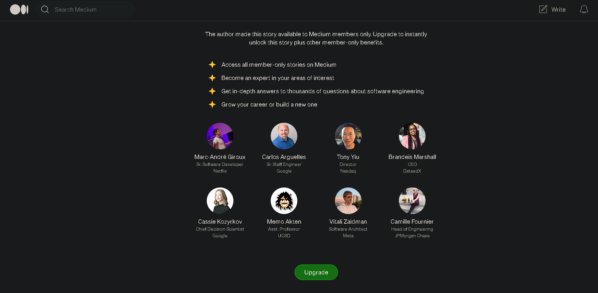
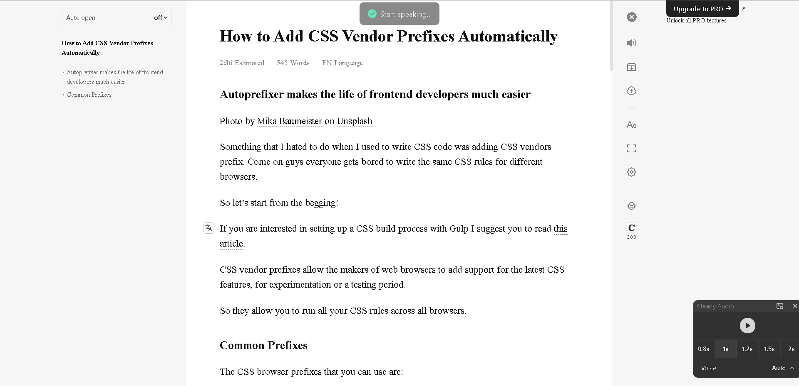

  
  <a href=""></a>
  

# Medium Premium
A Chrome extension to read the Premium blocked Medium articles for free.

## Installation

This extension is not availabe on the Chrome store.

You will have to add it manually to your Chrome browser 

First download the zip or clone the project and then load the src folder.
[Here are the steps](https://developer.chrome.com/docs/extensions/mv3/getstarted/development-basics/#load-unpacked)

## Additional requriements 
Download the - [ReadBee extension](https://chrome.google.com/webstore/detail/text-mode-for-websites-re/phjbepamfhjgjdgmbhmfflhnlohldchb) or [Clearly Reader](https://chrome.google.com/webstore/detail/clearly-reader-your-reade/odfonlkabodgbolnmmkdijkaeggofoop)
when the site gets fully loaded to read the text view of the page clearly.

    
## Usage
After loading the extension Open up a Medium Premium Blocked article and the click on the extension(Remember to pin the exension beforehand).

It will redirect you to a new "webcache.googleusercontent.com" page wait until it fully loads and then Click the [ReadBee extension](https://chrome.google.com/webstore/detail/text-mode-for-websites-re/phjbepamfhjgjdgmbhmfflhnlohldchb) or [Clearly Reader](https://chrome.google.com/webstore/detail/clearly-reader-your-reade/odfonlkabodgbolnmmkdijkaeggofoop) to read the page 

## Acknowledgements

 - [Chrome extension docs](https://developer.chrome.com/docs/extensions/)

## License

[MIT](https://choosealicense.com/licenses/mit/)

